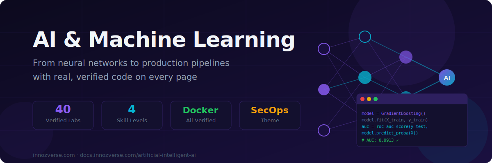

# AI & Machine Learning



> **Intelligence is not magic — it's mathematics, data, and code.**
> From your first neural network to deploying production ML pipelines — every concept is taught hands-on, with real Docker-verified code and cybersecurity-themed examples.

---


---

## 🗺️ Choose Your Level

<table data-view="cards">
  <thead>
    <tr>
      <th></th>
      <th></th>
      <th data-hidden data-card-target data-type="content-ref"></th>
    </tr>
  </thead>
  <tbody>
    <tr>
      <td><strong>🌱 Foundations</strong></td>
      <td>AI history, how LLMs work, prompt engineering, RAG, agents, ethics, safety, open-source vs closed models. 20 conceptual labs — no code required, code samples included.</td>
      <td><a href="foundations/">foundations/</a></td>
    </tr>
    <tr>
      <td><strong>⚔️ Practitioner</strong></td>
      <td>Hands-on ML: regression, trees, neural networks, NLP, embeddings, fine-tuning, RAG chatbots, AI agents, anomaly detection, multimodal AI, and deploying with FastAPI. All 20 labs Docker-verified.</td>
      <td><a href="practitioner/">practitioner/</a></td>
    </tr>
    <tr>
      <td><strong>🔴 Advanced</strong></td>
      <td>Computer vision pipelines, working with real LLM APIs, building AI applications at scale, adversarial ML, model hardening, production MLOps patterns.</td>
      <td><a href="advanced/">advanced/</a></td>
    </tr>
    <tr>
      <td><strong>🏛️ Architect</strong></td>
      <td>MLOps at scale: CI/CD for ML, feature stores, model registries, A/B testing, drift detection, Kubernetes serving, responsible AI governance, AI system design patterns.</td>
      <td><a href="architect/">architect/</a></td>
    </tr>
  </tbody>
</table>

---

## 📋 Curriculum Overview



**Understand AI before you build with it**

| Labs | Topics |
|------|--------|
| 01–03 | History of AI, how AI works, ML taxonomy |
| 04–06 | Data and bias, neural networks demystified, transformers and attention |
| 07–10 | LLMs explained, prompt engineering, AI agents, OpenClaw platform |
| 11–14 | Vision AI, AI in the real world, AI ethics, safety and alignment |
| 15–18 | Open-source vs closed, developer toolkit, building RAG, AI in cybersecurity |
| 19–20 | AI landscape 2025–2026, capstone: design your own AI product |

**No code execution required** — includes illustrative Python/PyTorch code samples throughout



**Build and train real ML models — all Docker-verified**

| Labs | Topics |
|------|--------|
| 01–03 | Linear/logistic regression, decision trees + random forests, gradient boosting + XGBoost |
| 04–06 | Feature engineering, model evaluation + metrics, neural networks from scratch (NumPy) |
| 07–09 | Convolutional neural networks, transfer learning, text classification with BERT |
| 10–12 | NER + information extraction, sentiment analysis pipeline, embeddings + semantic search |
| 13–15 | Fine-tuning with LoRA, RAG chatbot, AI agents (ReAct pattern + tool use) |
| 16–18 | Time series forecasting, anomaly detection (Isolation Forest + UEBA), multimodal AI |
| 19–20 | Deploying ML with FastAPI + Docker, end-to-end ML pipeline capstone |

**Docker image:** `zchencow/innozverse-ai:latest` · **Theme:** cybersecurity scenarios throughout



**Production-grade AI engineering**

| Labs | Topics |
|------|--------|
| 01–05 | PyTorch deep dive, custom training loops, advanced CV pipelines, object detection |
| 06–10 | LLM API integration, streaming, function calling, LangChain, vector databases |
| 11–15 | Building AI apps, adversarial examples, model robustness, prompt injection defence |
| 16–20 | MLflow experiment tracking, model versioning, distributed training, production capstone |

**Coming soon** — Advanced level labs in development



**Design AI systems that scale and comply**

| Labs | Topics |
|------|--------|
| 01–05 | MLOps foundations, CI/CD for ML, feature stores, model registry, A/B testing |
| 06–10 | Drift detection, monitoring dashboards, Kubernetes model serving, auto-scaling |
| 11–15 | Responsible AI, bias auditing, explainability frameworks, EU AI Act compliance |
| 16–20 | AI system design patterns, multi-model architectures, cost optimisation, capstone |

**Coming soon** — Architect level labs in development



---

## ⚡ Lab Format

Every Practitioner lab follows a consistent, verified format:


**Each lab includes:**
- 🎯 **Objective** — what you'll build and why it matters operationally
- 📚 **Background** — the theory and intuition behind each algorithm
- 🔬 **8 step-by-step instructions** — from environment setup to production capstone
- 📸 **Verified output** — real terminal output captured from Docker runs
- 💡 **Tip callouts** — explains *why*, not just *how*
- 🔒 **Security theme** — all examples use cybersecurity datasets (CVEs, SIEM, network traffic)


---

## 🐳 Quick Start



Every lab runs in a pre-built Docker image — no environment setup:

```bash
# Pull the lab image
docker pull zchencow/innozverse-ai:latest

# Start an interactive session
docker run -it --rm zchencow/innozverse-ai:latest bash

# Included packages:
# numpy 2.0.0 · scikit-learn 1.5.1 · xgboost · pandas · scipy
# fastapi · pydantic · matplotlib · seaborn · uvicorn
```

Then follow any Practitioner lab — all commands run inside this container.



```bash
# Python 3.11+ required
python3 -m venv ai-env
source ai-env/bin/activate

pip install numpy scikit-learn xgboost pandas scipy \
            fastapi pydantic uvicorn matplotlib seaborn
```



All Practitioner labs are compatible with Google Colab (free tier):

```python
# Colab already has most packages — just install extras
!pip install -q xgboost fastapi uvicorn pydantic
```

Open any lab, copy the code blocks into Colab cells — they run as-is.



---

## 🏆 Certifications Aligned

| Certification | Relevant Levels |
|---|---|
| **AWS ML Specialty** | Foundations + Practitioner |
| **Google Professional ML Engineer** | Practitioner + Advanced |
| **Azure AI Engineer Associate** | Foundations + Practitioner |
| **Databricks ML Professional** | Advanced + Architect |
| **TensorFlow Developer Certificate** | Practitioner |

---

## 🔒 Cybersecurity Theme


All Practitioner and Advanced labs use **cybersecurity-relevant datasets**:

- Network intrusion detection (classifying attack vs benign traffic)
- SIEM log anomaly detection (isolation forest on security events)
- CVE severity prediction and threat intelligence
- Malware classification from PE file features
- SOC alert triage with multimodal AI (text + screenshot analysis)

This makes concepts concrete for security professionals and adds real-world context for ML engineers wanting to enter the security space.


---

## 🚀 Start Here


**New to AI?** Start with [Lab 01: The History of AI](foundations/labs/lab-01-history-of-ai.md) — no prerequisites needed.

**Know Python, want to build ML models?** Jump to [Lab 01 Practitioner: Linear & Logistic Regression](practitioner/labs/lab-01-linear-logistic-regression.md).

**Security professional wanting AI skills?** Start with [Lab 17 Practitioner: Anomaly Detection for Security Logs](practitioner/labs/lab-17-anomaly-detection-security.md).

**Want to deploy a model?** Go to [Lab 19: Deploying ML with FastAPI + Docker](practitioner/labs/lab-19-deploy-ml-fastapi.md).

