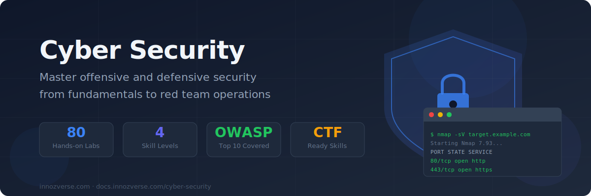
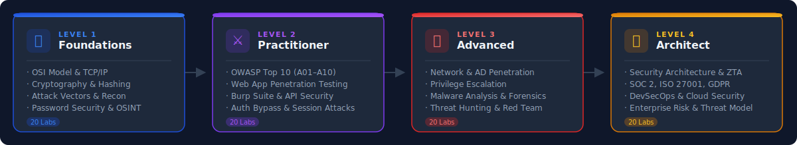

# Cyber Security



> **Think like an attacker. Defend like an architect.**
> From packet analysis to red team operations — every concept is taught hands-on, in real two-container Docker labs with verified terminal output.

---



---

## 🗺️ Choose Your Level

<table data-view="cards">
  <thead>
    <tr>
      <th></th>
      <th></th>
      <th data-hidden data-card-target data-type="content-ref"></th>
    </tr>
  </thead>
  <tbody>
    <tr>
      <td><strong>🌱 Foundations</strong></td>
      <td>Networking, cryptography, attack vectors, password security, social engineering. Build your mental model of how systems are broken — and protected. No prior experience needed.</td>
      <td><a href="foundations/">foundations/</a></td>
    </tr>
    <tr>
      <td><strong>⚔️ Practitioner</strong></td>
      <td>Full OWASP Top 10 coverage (A01–A10), web app penetration testing with Docker labs, API security, authentication bypass, session attacks, and a pentest capstone.</td>
      <td><a href="practitioner/">practitioner/</a></td>
    </tr>
    <tr>
      <td><strong>🔴 Advanced</strong></td>
      <td>Blind SQLi, SSTI, JWT attacks, race conditions, GraphQL, OAuth 2.0, SSRF, NoSQL injection, network pentesting, Linux privilege escalation, malware analysis, digital forensics, and red team capstone.</td>
      <td><a href="advanced/">advanced/</a></td>
    </tr>
    <tr>
      <td><strong>🏛️ Architect</strong></td>
      <td>Security architecture, zero trust design, SOC 2 / ISO 27001 / GDPR compliance, DevSecOps pipelines, enterprise risk management, and CISO-level governance.</td>
      <td><a href="architect/">architect/</a></td>
    </tr>
  </tbody>
</table>

---

## 📋 Curriculum Overview



**Build your security foundation — understand before you attack**

| Labs | Topics |
|------|--------|
| 01–04 | OSI Model, TCP/IP fundamentals, DNS deep dive, cryptography basics |
| 05–08 | Hashing & integrity, PKI & certificates, SSL/TLS, common attack vectors |
| 09–12 | Linux security, network recon with nmap, password security, social engineering |
| 13–16 | Malware types, firewalls & IDS, VPN & tunneling, web security basics |
| 17–20 | Wireless security, incident classification, security tools survey, CTF intro |

**Tools:** nmap, openssl, hashcat concepts, python3, curl



**Attack and defend real web applications — two-container Docker architecture**

| Labs | Topics |
|------|--------|
| 01–10 | **OWASP A01–A10** — every Top 10 vulnerability with live exploitation and mitigation |
| 11    | Web Recon: nmap, whatweb, gobuster directory brute-force |
| 12    | API Security: 6 attack vectors including BOLA, mass assignment, injection |
| 13–14 | Authentication Bypass, File Upload vulnerabilities |
| 15–17 | XXE Injection, Business Logic flaws, Session Management attacks |
| 18–20 | CSRF exploitation, Security Headers bypass, Pentest Capstone |

**Architecture:** Kali attacker container → Flask victim container via Docker network



**Professional-grade offensive security — all Docker-verified**

| Labs | Topics |
|------|--------|
| 01–05 | Blind SQLi (time-based), SSTI Jinja2, OS Command Injection, Pickle Deserialization, YAML injection |
| 06–10 | JWT Algorithm Confusion, Race Conditions, Advanced XSS+CSP Bypass, GraphQL IDOR, OAuth 2.0 |
| 11–15 | SSRF Advanced, NoSQL Injection, HTTP Parameter Pollution, Advanced Recon, Capstone |
| 16–18 | Linux Privilege Escalation, Lateral Movement & Persistence, Network Pentesting |
| 19–20 | Malware Analysis & Digital Forensics, Threat Hunting & Red Team Capstone |

**Images:** `zchencow/innozverse-advanced:latest` (victim) · `zchencow/innozverse-kali:latest` (attacker)



**Design and govern enterprise security at scale**

| Labs | Topics |
|------|--------|
| Labs | Topics |
|------|--------|
| 01–05 | SOC architecture, Elastic SIEM design, Threat Intelligence Platform (STIX/TAXII), Zero Trust (NIST SP 800-207), Cloud Security (CSPM/CWPP/CASB) |
| 06–10 | IAM architecture (SAML/OIDC/JWT/RBAC/PAM), PKI & CA design (3-tier, OCSP, SPIFFE), SOAR automation, Container & Kubernetes security, DevSecOps pipeline |
| 11–15 | Incident Response (NIST SP 800-61), Threat Hunting (PEAK/ATT&CK), Red Team Operations, BCP & Disaster Recovery, Compliance Frameworks (ISO 27001/SOC 2/PCI DSS) |
| 16–20 | Vulnerability Management (CVSS/EPSS), DLP Architecture, Network Security Review, Security Metrics & FAIR Risk Quantification, Capstone Enterprise Architecture |

**20 Labs · Docker-verified** — [Start here →](architect/README.md)



---

## 🐳 Quick Start



All practitioner and advanced labs use a two-container architecture. Pull both images first:

```bash
# Pull images (one-time setup)
docker pull zchencow/innozverse-cybersec:latest  # victim app (Flask)
docker pull zchencow/innozverse-kali:latest       # attacker (Kali Linux)
docker pull zchencow/innozverse-advanced:latest   # advanced victim apps

# Each lab creates its own isolated network
docker network create lab-a01

# Start victim
docker run -d --name victim-a01 --network lab-a01 \
  -v /path/to/victim_a01.py:/app/victim.py \
  zchencow/innozverse-cybersec:latest

# Start attacker (interactive)
docker run -it --rm --network lab-a01 zchencow/innozverse-kali:latest bash
```

Then follow the lab instructions — all commands run inside the attacker container.



Foundations labs run directly on Ubuntu/macOS/WSL:

```bash
# Install common tools
sudo apt-get update
sudo apt-get install -y nmap curl python3 openssl hashcat john

# Or use the foundations image
docker run -it --rm zchencow/innozverse-cybersec:latest bash
```



Verify your setup works with this one-liner:

```bash
# Pull + run a quick smoke test
docker run --rm zchencow/innozverse-kali:latest \
  bash -c "nmap --version && python3 --version && echo '✅ Ready'"
```

Expected output: `Nmap 7.xx ... Python 3.x.x ... ✅ Ready`



---

## ⚡ Lab Format

Every lab follows a consistent, professional format:


**Each lab includes:**
- 🎯 **Objective** — what you'll achieve and why it matters in real engagements
- 📚 **Background** — the theory behind the attack or defence
- 🔬 **8 step-by-step instructions** — real commands with real tools
- 📸 **Verified output** — actual terminal output captured from live Docker runs
- 🛡️ **Mitigations** — how to fix or defend against each vulnerability
- 💡 **Tip callouts** — explains *why* not just *how*


---

## 🏆 Certifications Aligned

| Certification | Relevant Levels |
|---|---|
| **CompTIA Security+** | Foundations + Practitioner |
| **CEH — Certified Ethical Hacker** | Practitioner + Advanced |
| **OSCP (OffSec)** | Advanced |
| **CISSP** | Architect |
| **AWS Security Specialty** | Advanced → Architect |
| **OWASP WSTG** | Practitioner (full A01–A10 coverage) |

---

## ⚠️ Legal & Ethical Notice


**All techniques in this curriculum are for authorised use only.**

- Only attack systems you own or have **explicit written permission** to test
- All Docker labs use isolated internal networks — no internet-facing targets
- Never apply offensive techniques to production systems or third-party targets
- Unauthorised computer access is a criminal offence in most jurisdictions (Computer Fraud and Abuse Act, Computer Misuse Act, etc.)


---

## 🚀 Start Here


**New to cybersecurity?** Start with [Lab 01: OSI Model Deep Dive](foundations/labs/lab-01-osi-model-deep-dive.md) — no prior experience required.

**Know web development?** Jump to [Lab 04: SQL Injection (OWASP A03)](practitioner/labs/lab-04-sql-injection-a03.md) — build a vulnerable Flask app and exploit it in 60 minutes.

**Coming from IT/sysadmin?** Start at [Lab 09: Linux Security Basics](foundations/labs/lab-09-linux-security-basics.md) — your existing knowledge will accelerate learning.

**Ready for red team?** Go straight to [Advanced Lab 01: Blind SQL Injection](advanced/labs/lab-01-blind-sqli.md) — assumes practitioner-level foundations.

