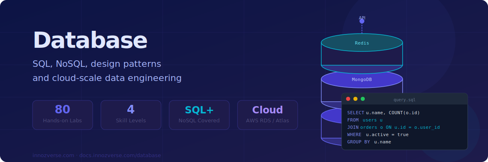
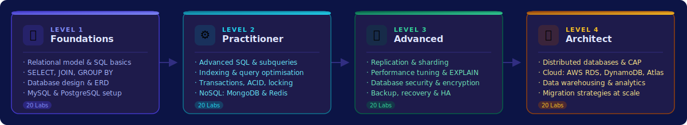

# Database



> **Data is the foundation of every application. Master how to store, query, and scale it.**
> From your first SQL query to designing globally distributed databases — every concept is taught hands-on with real engines.

---



---

## 🗺️ Choose Your Level

<table data-view="cards">
  <thead>
    <tr>
      <th></th>
      <th></th>
      <th data-hidden data-card-target data-type="content-ref"></th>
    </tr>
  </thead>
  <tbody>
    <tr>
      <td><strong>🌱 Foundations</strong></td>
      <td>Relational model, SQL basics, SELECT/JOIN/GROUP BY, schema design, ERDs. Set up MySQL and PostgreSQL from scratch.</td>
      <td><a href="foundations/README.md">foundations/README.md</a></td>
    </tr>
    <tr>
      <td><strong>⚙️ Practitioner</strong></td>
      <td>Advanced SQL, subqueries, window functions, indexing strategies, ACID transactions, and hands-on NoSQL with MongoDB and Redis.</td>
      <td><a href="practitioner/README.md">practitioner/README.md</a></td>
    </tr>
    <tr>
      <td><strong>🔴 Advanced</strong></td>
      <td>Replication, sharding, query optimisation with EXPLAIN, database security, encryption, backup strategies and high availability.</td>
      <td><a href="advanced/README.md">advanced/README.md</a></td>
    </tr>
    <tr>
      <td><strong>🏛️ Architect</strong></td>
      <td>Distributed systems, CAP theorem, cloud databases (AWS RDS, DynamoDB, MongoDB Atlas), data warehousing and large-scale migrations.</td>
      <td><a href="architect/README.md">architect/README.md</a></td>
    </tr>
  </tbody>
</table>

---

## 📋 Curriculum Overview



**Learn to think in tables, rows, and relationships**

| Labs | Topics |
|------|--------|
| 1–5  | Relational model, installing MySQL/PostgreSQL, CREATE/INSERT/SELECT |
| 6–10 | WHERE, ORDER BY, GROUP BY, HAVING, aggregate functions |
| 11–15 | JOINs (INNER, LEFT, RIGHT, FULL), subqueries, views |
| 16–20 | Database design, normalisation (1NF–3NF), ERD, foreign keys, constraints |

**Databases:** MySQL 8, PostgreSQL 15



**Go beyond basics — write queries that perform**

| Labs | Topics |
|------|--------|
| 1–5  | Window functions, CTEs, recursive queries, stored procedures |
| 6–10 | Indexing strategy, EXPLAIN ANALYSE, slow query log, covering indexes |
| 11–15 | ACID transactions, isolation levels, deadlocks, row locking |
| 16–20 | MongoDB CRUD, aggregation pipeline; Redis data structures, pub/sub, caching |

**Databases:** MySQL, PostgreSQL, MongoDB, Redis



**Build databases that survive failure and scale under load**

| Labs | Topics |
|------|--------|
| 1–5  | MySQL/PostgreSQL replication (primary-replica), binary log |
| 6–10 | Horizontal sharding, partitioning, consistent hashing |
| 11–15 | Query profiling, buffer pool tuning, connection pooling (PgBouncer) |
| 16–20 | Encryption at rest/transit, audit logging, backup & point-in-time recovery |

**Tools:** pgBouncer, ProxySQL, mysqldump, pg_dump, Percona



**Design data systems at cloud and enterprise scale**

| Labs | Topics |
|------|--------|
| 1–5  | Distributed databases, CAP theorem, eventual consistency, Paxos/Raft |
| 6–10 | AWS RDS (multi-AZ, read replicas), DynamoDB, Aurora Serverless |
| 11–15 | MongoDB Atlas, data warehousing (Redshift, BigQuery concepts) |
| 16–20 | Schema migrations at scale, zero-downtime deployments, data governance |

**Platforms:** AWS RDS, DynamoDB, MongoDB Atlas, Snowflake concepts



---

## ⚡ Lab Format

Every lab uses a real database engine running in Docker with verified output:


**Each lab includes:**
- 🎯 **Objective** — clear goal and real-world relevance
- 🔬 **8 numbered steps** — progressive complexity, real SQL and shell commands
- 📸 **Verified output** — actual query results captured from live Docker runs
- 💡 **Tip callouts** — what each clause means and why it matters
- 🏁 **Step 8 Capstone** — a real-world scenario tying all concepts together
- 📋 **Summary table** — quick reference for the lab's key commands


---

## 🚀 Quick Start



```bash
# Start MySQL 8
docker run -d --name mysql-lab \
  -e MYSQL_ROOT_PASSWORD=labpass \
  -p 3306:3306 mysql:8.0

# Connect
docker exec -it mysql-lab mysql -uroot -plabpass
```



```bash
# Start PostgreSQL 15
docker run -d --name pg-lab \
  -e POSTGRES_PASSWORD=labpass \
  -p 5432:5432 postgres:15

# Connect
docker exec -it pg-lab psql -U postgres
```



```bash
# Start MongoDB
docker run -d --name mongo-lab \
  -p 27017:27017 mongo:7

# Connect
docker exec -it mongo-lab mongosh
```



```bash
# Start Redis
docker run -d --name redis-lab \
  -p 6379:6379 redis:7

# Connect
docker exec -it redis-lab redis-cli
```



---

## 🏆 Certifications Aligned

| Certification | Relevant Levels |
|---|---|
| **Oracle MySQL 8 Developer** | Foundations + Practitioner |
| **PostgreSQL Associate (EDB)** | Foundations + Practitioner |
| **MongoDB Certified Developer** | Practitioner + Advanced |
| **AWS Certified Database Specialty** | Advanced + Architect |
| **Google Professional Data Engineer** | Architect |
| **Snowflake SnowPro Core** | Architect |

