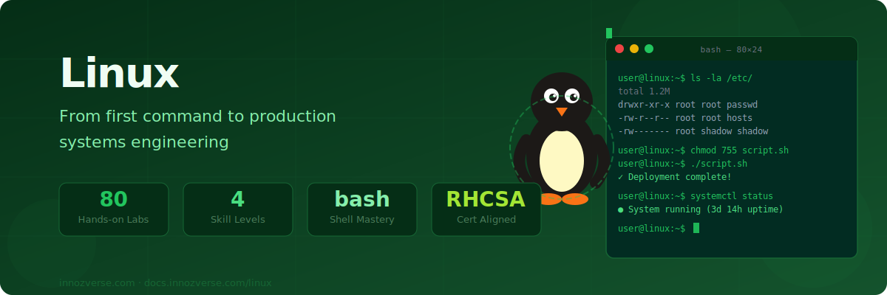
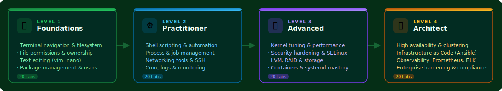

# Linux



> **In a world of GUIs, the command line is your superpower.**
> From your first `ls` to managing production clusters — every concept is taught hands-on, with real commands and verified output.

---



---


**480 labs · 4 levels · Docker-verified output** — every command tested on Ubuntu 22.04


---

## 🗺️ Choose Your Level

<table data-view="cards">
  <thead>
    <tr>
      <th></th>
      <th></th>
      <th data-hidden data-card-target data-type="content-ref"></th>
    </tr>
  </thead>
  <tbody>
    <tr>
      <td><strong>🌱 Foundations</strong></td>
      <td>Terminal navigation, filesystem, permissions, text editing, users and packages. No prior experience needed — start from zero.</td>
      <td><a href="foundations/">foundations/</a></td>
    </tr>
    <tr>
      <td><strong>⚙️ Practitioner</strong></td>
      <td>Shell scripting, process management, networking tools, SSH, cron automation, log management. Become a confident Linux user.</td>
      <td><a href="practitioner/">practitioner/</a></td>
    </tr>
    <tr>
      <td><strong>🔒 Advanced</strong></td>
      <td>Kernel tuning, security hardening, SELinux/AppArmor, LVM, storage, containers, namespaces, cgroups, systemd mastery.</td>
      <td><a href="advanced/">advanced/</a></td>
    </tr>
    <tr>
      <td><strong>🏛️ Architect</strong></td>
      <td>High availability, Ansible automation, Prometheus/Grafana/ELK observability, enterprise hardening and compliance at scale.</td>
      <td><a href="architect/">architect/</a></td>
    </tr>
  </tbody>
</table>

---

## 📋 Curriculum Overview



**Master the Linux filesystem and command line from scratch**

| Labs | Topics | Key Commands |
|------|--------|-------------|
| 01–05 | Terminal, FHS, navigation, file creation & viewing, copy/move | `ls`, `cd`, `pwd`, `touch`, `cp`, `mv` |
| 06–10 | Delete files, permissions, chmod, chown, users & groups | `rm`, `chmod`, `chown`, `useradd`, `groupadd` |
| 11–15 | nano editor, grep, find, processes, disk usage | `nano`, `grep`, `find`, `ps`, `df`, `du` |
| 16–20 | Package management, I/O redirection, env vars, scripting, networking | `apt`, `>`, `>>`, `\|`, `export`, `ping`, `curl` |

**Environment:** `docker run -it --rm ubuntu:22.04 bash`



**Automate tasks and administer systems confidently**

| Labs | Topics | Key Commands |
|------|--------|-------------|
| 01–05 | Shell scripting: variables, loops, functions, error handling, automation | `bash`, `if`, `for`, `while`, `trap`, `set -euo` |
| 06–10 | Process management, background jobs, cron, systemd, monitoring | `kill`, `nohup`, `crontab`, `systemctl`, `vmstat` |
| 11–15 | Networking: ip/ss, curl/wget, ufw, iptables, diagnostics | `ip`, `ss`, `curl`, `ufw`, `iptables`, `dig` |
| 16–20 | SSH key auth, journalctl, performance tuning, grep/awk/sed, capstone | `ssh-keygen`, `journalctl`, `awk`, `sed` |

**Environment:** `docker run -it --rm ubuntu:22.04 bash`



**Tune, harden, and manage complex Linux systems**

| Labs | Topics | Key Tools |
|------|--------|-----------|
| 01–05 | sysctl kernel params, perf profiling, strace, lsof, CPU/memory analysis | `sysctl`, `perf`, `strace`, `lsof`, `vmstat` |
| 06–10 | CIS hardening, SELinux, AppArmor, auditd, fail2ban | `chattr`, `setenforce`, `aa-enforce`, `auditctl`, `fail2ban-client` |
| 11–15 | LVM, software RAID, ext4/xfs/btrfs tuning, LUKS encryption, NFS | `lvcreate`, `mdadm`, `tune2fs`, `cryptsetup`, `exportfs` |
| 16–20 | Namespaces, cgroups, Docker internals, systemd deep dive, capstone | `unshare`, `nsenter`, `cgcreate`, `runc`, `systemd-analyze` |

**Environment:** `docker run -it --rm --privileged ubuntu:22.04 bash`



**Design and operate enterprise Linux infrastructure**

| Labs | Topics |
|------|--------|
| 01–05 | High availability with Pacemaker/Corosync, load balancing, clustering |
| 06–10 | Infrastructure as Code: Ansible playbooks, roles, inventory, vault |
| 11–15 | Observability: Prometheus metrics, Grafana dashboards, ELK log pipeline |
| 16–20 | Enterprise hardening, CIS benchmarks, compliance automation |

🚧 **In development** — coming soon



---

## ⚡ Lab Format

Every lab is production-quality with Docker-verified output:


**Each lab includes:**
- 🎯 **Objective** — clear goal and real-world relevance
- 🔬 **8 numbered steps** — progressive complexity, real Ubuntu 22.04 commands
- 📸 **Verified output** — actual terminal results captured from live Docker runs
- 💡 **Tip callouts** — what each flag means and why it matters
- 🏁 **Step 8 Capstone** — a real-world scenario tying all concepts together
- 📋 **Summary table** — quick reference for the lab's key commands


---

## 🚀 Quick Start



```bash
# Pull and enter Ubuntu 22.04 — identical to the lab environment
docker run -it --rm ubuntu:22.04 bash

# Verify you're in the right place
uname -a
cat /etc/os-release
```



```bash
# Already on Ubuntu 22.04? Just open a terminal.
# On Windows? Use WSL2:
wsl --install -d Ubuntu-22.04

# Verify
lsb_release -a
```



```bash
# GitHub Codespaces — free 60h/month, Ubuntu-based
# 1. Go to github.com/codespaces
# 2. New codespace → Blank
# 3. All labs work out of the box
```



---

## 🏆 Certifications Aligned

| Certification | Relevant Levels |
|---|---|
| **CompTIA Linux+** | Foundations + Practitioner |
| **LPIC-1** | Foundations + Practitioner |
| **LPIC-2** | Advanced |
| **RHCSA** | Practitioner + Advanced |
| **RHCE** | Advanced + Architect |
| **LFCS (Linux Foundation)** | Foundations + Practitioner |
| **CKA (Kubernetes Admin)** | Advanced + Architect |
