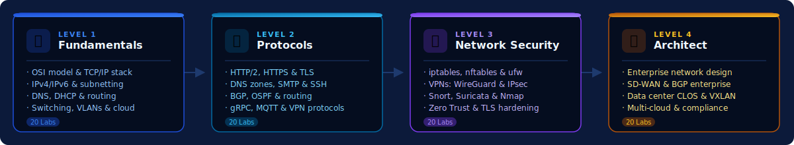

# Networking


> **Every packet has a story — learn to read, route, and secure them.**
> From your first `ping` to designing enterprise-grade network architectures — every concept is taught hands-on, with real commands and verified output.

---



---


**80 labs · 4 levels · Docker-verified output** — every command tested on Ubuntu 22.04


---

## 🗺️ Choose Your Level

<table data-view="cards">
  <thead>
    <tr>
      <th></th>
      <th></th>
      <th data-hidden data-card-target data-type="content-ref"></th>
    </tr>
  </thead>
  <tbody>
    <tr>
      <td><strong>🌐 Fundamentals</strong></td>
      <td>OSI model, IPv4/IPv6 addressing, subnetting, routing basics, DNS, DHCP, TCP/IP. Build the foundation every network engineer needs.</td>
      <td><a href="foundations/README.md">foundations/README.md</a></td>
    </tr>
    <tr>
      <td><strong>📡 Protocols</strong></td>
      <td>Deep-dive into TCP/IP, DNS, HTTP/2, HTTPS/TLS, SSH, SMTP, SNMP, BGP, OSPF, MQTT, VPN protocols. Understand the internet's building blocks.</td>
      <td><a href="protocols/README.md">protocols/README.md</a></td>
    </tr>
    <tr>
      <td><strong>🔒 Network Security</strong></td>
      <td>iptables, nftables, ufw, OpenVPN, WireGuard, IPsec, Snort, Suricata, Nmap, PCAP forensics, Zero Trust, RADIUS, DNSSEC, TLS hardening.</td>
      <td><a href="security/README.md">security/README.md</a></td>
    </tr>
    <tr>
      <td><strong>🏛️ Architect</strong></td>
      <td>Enterprise network design, SD-WAN, BGP at scale, MPLS VPN, data center CLOS/EVPN-VXLAN, campus Wi-Fi 6, micro-segmentation, multi-cloud networking, compliance auditing.</td>
      <td><a href="architect/README.md">architect/README.md</a></td>
    </tr>
  </tbody>
</table>

---

## 📋 Curriculum Overview



**Build your networking foundation from the ground up**

| Labs | Topics | Key Commands |
|------|--------|-------------|
| 01–05 | OSI model, TCP/IP stack, IPv4 addressing, subnetting, IPv6 | `ip addr`, `ip route`, `ping`, `traceroute`, `ipcalc` |
| 06–10 | MAC/Ethernet, routing basics, NAT/port forwarding, DNS, DHCP | `arp`, `ip neigh`, `nftables`, `dig`, `nslookup` |
| 11–15 | TCP deep dive, UDP/ICMP, HTTP/HTTPS, troubleshooting tools | `tcpdump`, `wireshark`, `curl`, `netstat`, `ss` |
| 16–20 | Switching/VLANs, wireless basics, network security fundamentals, cloud, capstone | `ip link`, `bridge`, `iw`, `ufw`, `nmap` |

**Environment:** `docker run -it --rm ubuntu:22.04 bash`



**Master the protocols that power the internet**

| Labs | Topics | Key Tools |
|------|--------|-----------|
| 01–05 | Packet analysis, DNS zones/records, BIND9 resolver, HTTP/1.1 internals, HTTP/2 & HTTP/3 | `tcpdump`, `dig`, `named`, `curl -v` |
| 06–10 | HTTPS/TLS handshake, DHCP server, FTP/SFTP, SMTP/POP3/IMAP, SSH internals | `openssl`, `dhcpd`, `vsftpd`, `postfix`, `ssh -v` |
| 11–15 | SNMP monitoring, NTP, LDAP directory, REST APIs, gRPC & protobuf | `snmpwalk`, `ntpq`, `ldapsearch`, `grpcurl` |
| 16–20 | BGP routing, OSPF, MQTT/CoAP IoT, VPN protocols (IPsec/WireGuard/OpenVPN), capstone | `bgpd`, `ospfd`, `mosquitto`, `wg`, `openvpn` |

**Environment:** `docker run -it --rm ubuntu:22.04 bash`



**Defend, monitor, and harden your network**

| Labs | Topics | Key Tools |
|------|--------|-----------|
| 01–05 | iptables stateful rules, nftables, ufw, DMZ architecture, zone segmentation | `iptables`, `nft`, `ufw`, `ip netns` |
| 06–10 | OpenVPN, WireGuard, IPsec site-to-site, Snort IDS, Suricata | `openvpn`, `wg-quick`, `strongswan`, `snort` |
| 11–15 | tcpdump traffic analysis, Nmap scanning, OpenVAS vulnerability scanner, PCAP forensics, DDoS mitigation | `tcpdump`, `nmap`, `openvas`, `tshark` |
| 16–20 | Zero Trust architecture, 802.1X/RADIUS, DNSSEC, TLS hardening, capstone network audit | `freeradius`, `dnssec-keygen`, `testssl.sh` |

**Environment:** `docker run -it --rm ubuntu:22.04 bash`



**Design and operate enterprise network infrastructure**

| Labs | Topics | Key Tools |
|------|--------|-----------|
| 01–05 | Enterprise network design, SD-WAN, network automation (Ansible), BGP enterprise, MPLS VPN | `ansible`, `bgpd`, `mpls`, `vtysh` |
| 06–10 | Cloud networking, NFV/SDN, load balancing at scale, network observability, IPv6 migration | `HAProxy`, `nginx`, `prometheus`, `grafana` |
| 11–15 | DNS at scale, CDN architecture, WAN optimisation, disaster recovery, campus Wi-Fi 6 | `PowerDNS`, `bind9`, `tc`, `iw` |
| 16–20 | Data center CLOS/EVPN-VXLAN, micro-segmentation, compliance (CIS/PCI DSS), multi-cloud, capstone | `FRRouting`, `vxlan`, `istio`, `terraform` |

**Environment:** `docker run -it --rm ubuntu:22.04 bash`



---

## ⚡ Lab Format

Every lab is production-quality with Docker-verified output:


**Each lab includes:**
- 🎯 **Objective** — clear goal and real-world relevance
- 🔬 **8 numbered steps** — progressive complexity, real Ubuntu 22.04 commands
- 📸 **Verified output** — actual terminal results captured from live Docker runs
- 💡 **Tip callouts** — what each flag means and why it matters
- 🏁 **Step 8 Capstone** — a real-world scenario tying all concepts together
- 📋 **Summary table** — quick reference for the lab's key commands


---

## 🚀 Quick Start



```bash
# Pull and enter Ubuntu 22.04 — identical to the lab environment
docker run -it --rm ubuntu:22.04 bash

# Verify networking tools are available
ip a
ping -c 3 8.8.8.8
```



```bash
# Already on Ubuntu 22.04? Just open a terminal.
# On Windows? Use WSL2:
wsl --install -d Ubuntu-22.04

# Verify
ip route show
ss -tulnp
```



```bash
# GitHub Codespaces — free 60h/month, Ubuntu-based
# 1. Go to github.com/codespaces
# 2. New codespace → Blank
# 3. All labs work out of the box
```



---

## 🏆 Certifications Aligned

| Certification | Relevant Levels |
|---|---|
| **CompTIA Network+** | Fundamentals + Protocols |
| **Cisco CCNA** | Fundamentals + Protocols + Security |
| **Cisco CCNP** | Security + Architect |
| **CompTIA Security+** | Network Security |
| **Certified Ethical Hacker (CEH)** | Network Security |
| **CCIE Enterprise** | Architect |
| **AWS/GCP/Azure Networking** | Architect |
