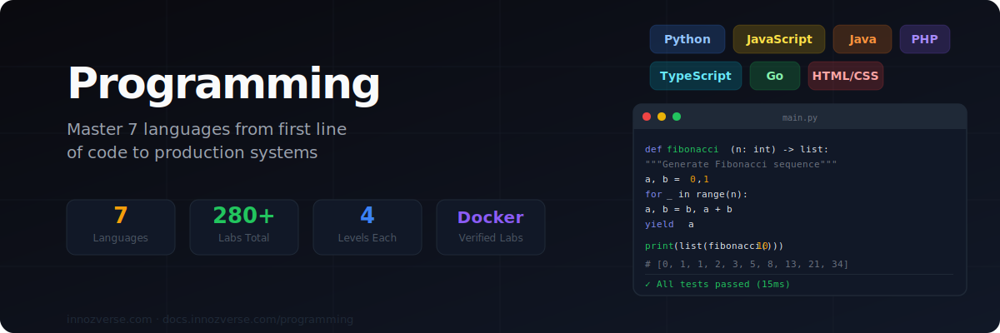

# Programming

> **Write your first line of code. Ship your first production app. Master 7 languages.**
> Every lab runs in Docker — verified output, real compilers, real runtimes.

---

## 🌐 Choose Your Language

<table data-view="cards">
  <thead>
    <tr><th></th><th></th><th data-hidden data-card-target data-type="content-ref"></th></tr>
  </thead>
  <tbody>
    <tr>
      <td><strong>🐍 Python</strong></td>
      <td>The most versatile language. Data science, web, automation, AI. 4 levels × 15 labs = 60 labs.</td>
      <td><a href="python/">python/</a></td>
    </tr>
    <tr>
      <td><strong>🟨 JavaScript</strong></td>
      <td>The language of the web. Frontend, Node.js backend, full-stack. 4 levels × 15 labs = 60 labs.</td>
      <td><a href="javascript/">javascript/</a></td>
    </tr>
    <tr>
      <td><strong>☕ Java</strong></td>
      <td>Enterprise powerhouse. Spring Boot, microservices, Android. 4 levels × 15 labs = 60 labs.</td>
      <td><a href="java/">java/</a></td>
    </tr>
    <tr>
      <td><strong>🐘 PHP</strong></td>
      <td>Powers 80% of the web. Laravel, REST APIs, WordPress. 4 levels × 10 labs = 40 labs.</td>
      <td><a href="php/">php/</a></td>
    </tr>
    <tr>
      <td><strong>🌐 HTML/CSS</strong></td>
      <td>The foundation of every website. 15 Foundations labs covering Flexbox, Grid, Responsive, Animations, Accessibility, and CSS Variables. Docker image: <code>zchencow/innozverse-htmlcss:latest</code></td>
      <td><a href="html-css/">html-css/</a></td>
    </tr>
    <tr>
      <td><strong>🔷 TypeScript</strong></td>
      <td>JavaScript with superpowers. Type safety, generics, enterprise-grade JS. 2 levels × 12 labs = 24 labs.</td>
      <td><a href="typescript/">typescript/</a></td>
    </tr>
    <tr>
      <td><strong>🐹 Go</strong></td>
      <td>Built for the cloud era. Concurrency, microservices, CLI tools. 2 levels × 15 labs = 30 labs.</td>
      <td><a href="go/">go/</a></td>
    </tr>
  </tbody>
</table>

---

## 📋 All Languages at a Glance



| Level | Labs | Highlights |
|-------|------|-----------|
| Foundations | 15 | Variables, lists, functions, OOP, file I/O |
| Practitioner | 15 | Decorators, async, Flask, pytest, regex |
| Advanced | 15 | FastAPI, SQLAlchemy, pandas, asyncio, packaging |
| Expert | 15 | Architecture, performance, microservices, ML pipeline |

**Runtime:** Python 3.12 · **Docker:** `innozverse-python:latest`



| Level | Labs | Highlights |
|-------|------|-----------|
| Foundations | 15 | Basics, arrays, objects, closures, classes |
| Practitioner | 15 | Promises, async/await, Express, Jest, streams |
| Advanced | 15 | TypeScript, design patterns, WebSockets, GraphQL |
| Expert | 15 | Microservices, performance, security, production ops |

**Runtime:** Node.js 20 · **Docker:** `innozverse-js:latest`



| Level | Labs | Highlights |
|-------|------|-----------|
| Foundations | 15 | OOP, generics, collections, exceptions, I/O |
| Practitioner | 15 | Streams, lambdas, JDBC, JUnit 5, design patterns |
| Advanced | 10 | Spring Boot, REST API, JPA, microservices, Docker |
| Expert | 10 | Reactive, security, performance, cloud-native Java |

**Runtime:** Java 21 · **Docker:** `innozverse-java:latest`



| Language | Levels | Total Labs |
|----------|--------|-----------|
| PHP 8.3 | Foundations + Practitioner + Advanced | 40 labs |
| HTML/CSS | Foundations (15 labs complete) | Flexbox, Grid, Responsive, Animations, Accessibility, CSS Variables · `zchencow/innozverse-htmlcss:latest` |
| TypeScript | Foundations + Practitioner | 24 labs |
| Go 1.22 | Foundations + Practitioner | 30 labs |

All verified with Docker containers.



---

## ⚡ Lab Format


**Every lab is Docker-verified:**
- 🎯 **Objective** — what you build and why it matters
- 📚 **Background** — language concepts and theory
- 🔬 **Step-by-step** — real code with 8+ hands-on steps
- 📸 **Verified output** — actual output from Docker containers
- 🚨 **Common mistakes** — language-specific gotchas
- 🔗 **Further reading** — official docs and resources



**Prerequisites:** Docker installed. Each language has its own pre-built container — no local language installation needed. All labs verified on Ubuntu 22.04.


---

## 🏆 Where This Takes You

| Goal | Recommended Path |
|---|---|
| **Web developer** | HTML/CSS → JavaScript → TypeScript |
| **Backend engineer** | Python or Java → Practitioner → Advanced |
| **Cloud/DevOps** | Go → Python → TypeScript |
| **Data/AI** | Python Foundations → Advanced (pandas/numpy) |
| **Enterprise** | Java → Spring Boot → Microservices |
| **Full-stack** | HTML/CSS + JavaScript → Node.js + TypeScript |
